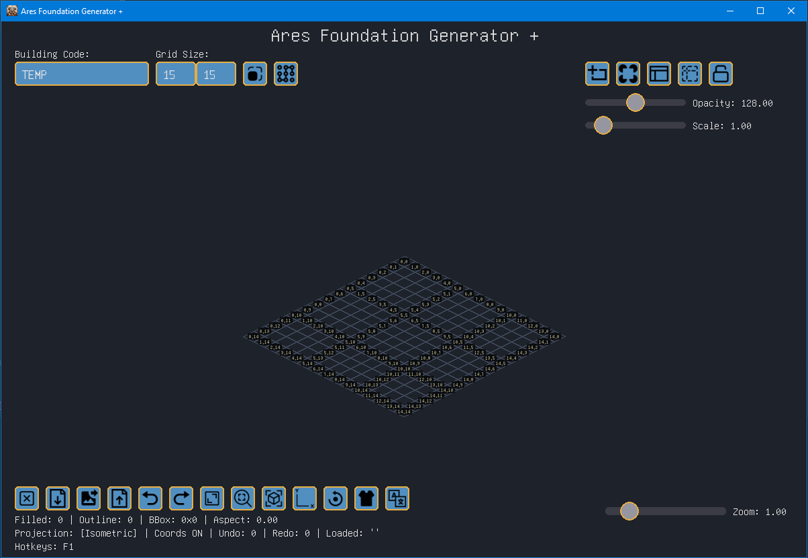

# Ares Foundation Generator +

[](https://www.python.org/downloads/)
[](https://www.pygame.org/)
[](https://numpy.org/)
[](LICENSE)

🇬🇧 [English](README.md) | 🇷🇺 [Русский](README.ru.md) | 🇨🇳 [简体中文](README.zh-CN.md) | 🇹🇼 [繁體中文](README.zh-TW.md)

**Ares Foundation Generator +** 是一款桌面應用程式，用於創建和編輯遊戲關卡（例如 ARES）的建築地基。它提供正交和等角投影、模板疊加、復原/重做以及導出為 INI/圖像格式。



## 功能

- 交互式網格編輯（左鍵添加，右鍵移除）
- 輪廓模式（按住 `Ctrl` 編輯地基輪廓）
- 根據填充單元格自動生成輪廓
- 正交和等角投影
- 模板圖像疊加（PNG、JPG 等），支持透明度和縮放
- 復原/重做（Ctrl+Z / Ctrl+Y）
- 將地基數據導出為 INI 文件（可直接用於 ARES）
- 將正交和等角視圖導出為 PNG 圖像
- 加載現有 INI 文件（拖放或通過按鈕）
- 可調整網格大小（5x5 至 50x50）
- 配色方案和多語言支持（English, Русский, 简体中文, 繁體中文）
- 完全可調整大小的窗口，支持縮放和平移

## 環境要求

- Python 3.8+
- Pygame
- NumPy
- Tkinter（通常隨 Python 一起提供）

## 安裝與運行

1. 克隆倉庫：
   ``` bash
   git clone https://github.com/YoVVassup/ares-foundation-generator-plus.git
   cd ares-foundation-generator-plus
   ```

2. （可選）創建並激活虛擬環境：
   ``` bash
   python -m venv .venv
   .venv\Scripts\activate   # Windows
   source .venv/bin/activate  # Linux/Mac
   ```

3. 安裝依賴：
   ``` bash
   pip install pygame numpy zstandard
   ```

4. 運行應用程式：
   ``` bash
   python main.py
   ```

## 構建可執行文件（Windows）

提供了一個 PowerShell 構建腳本 `Run.ps1`。它使用 **Nuitka** 將程序編譯為獨立的 `.exe` 文件。

- 安裝 Nuitka：`pip install nuitka`
- 在 PowerShell 中運行 `.\Run.ps1`（可能需要調整執行策略：`Set-ExecutionPolicy RemoteSigned -Scope Process`）

輸出將位於 `Ares Foundation Generator Plus` 文件夾中。

## 基本用法

- **鼠標左鍵** – 填充單元格
- **鼠標右鍵** – 清空單元格
- **Ctrl + 左/右鍵** – 編輯輪廓單元格
- **鼠標中鍵** – 平移視圖
- **Ctrl + 鼠標中鍵** – 平移模板
- **鼠標滾輪** – 縮放網格
- **Ctrl + 鼠標滾輪** – 縮放模板
- **G** – 根據填充單元格生成輪廓
- **C** – 清空整個網格
- **L** – 加載 INI 文件
- **Ctrl+E** – 導出為 INI
- **Ctrl+Shift+S** – 保存為圖像
- **F** – 使網格適應屏幕
- **P** – 切換投影
- **O** – 切換坐標顯示
- **R** – 重置視圖
- **Z** – 重置縮放
- **Ctrl+Z / Ctrl+Y** – 復原 / 重做
- **F1** – 顯示/隱藏幫助

## 文件結構

- `main.py` – 入口點，主循環，事件處理
- `grid.py` – 網格數據模型和輪廓生成
- `renderer.py` – 繪製正交/等角視圖
- `ui.py` – UI 組件（按鈕、滑塊、對話框）
- `commands.py` – 命令模式，實現復原/重做
- `localization.py` – 多語言支持
- `settings.py` – 持久化設置（INI）
- `constants.py` – 全局常量和配色方案
- `utils.py` – 路徑輔助函數
- `language_*.ini` – 翻譯文件
- `icons/` – 圖標文件（SVG/PNG）
- `Unifont.ttf` – 字體文件（可選）

## 許可證

本項目採用 MIT 許可證 – 有關詳細信息，請參閱 [LICENSE](LICENSE) 文件。